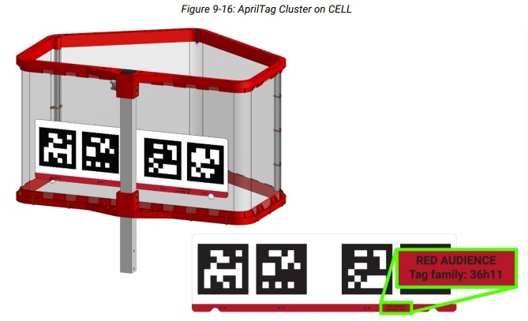
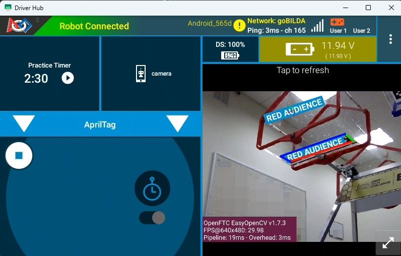
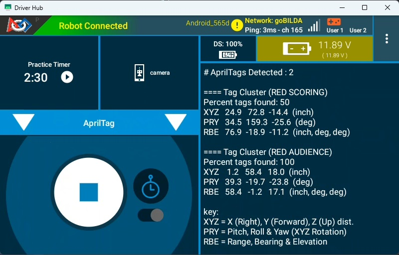

AprilTag Clusters
==================

Started in the 2023-2024 season, Tech Tips are a segment released in the
*FIRST* Tech Challenge `Team E-mail Blast
<https://www.firstinspires.org/resources/library/ftc/team-email-blast-archive>`__.
Sometimes the Tech Tips are included in whole in the email blast, but sometimes
there is more content than is reasonable in the email blast so partial content
is included in the blast with the rest of the content here.

.. _apriltagclusters:

AprilTag Cluster Introduction
-----------------------------

A new feature released in FTC SDK 12.0 is AprilTag Clusters. This is a technique
that groups multiple AprilTags together for multi-tag object and camera tracking. 
AprilTag clusters have many benefits:

* When tracking a single target, especially at extreme angles, the accuracy of the
  tracking can be inaccurate and "jittery" - when multiple tags are detected, the
  accuracy increases significantly and the "jitter" all but disappears.

* If any part of a tag is obstructed the tag cannot be identified; breaking up a large
  detection area into multiple tags greatly increases the likelihood that one or more
  tags will be fully detected. Combining multiple tags in this way into a "cluster"
  greatly improves detectability because when combined, only a minimum of one of the
  tags needs to be detected in order to detect the whole cluster.

* When a single AprilTag is detected, the detected "location" of the tag (which is
  used to calculate range, bearing, elevation, and other properties of the AprilTag
  pose) is the center of the detected AprilTag. However, when grouped into
  a cluster, the cluster can report ANY relative location from the center of the
  cluster. This means the cluster can report a location - relative to the cluster -
  that isn't even within the bounds of the cluster. This allows the AprilTag cluster to 
  "point" to any "location/target" nearby the cluster! 

As an example, each HIVE CELL in BIOBUZZ has a 4-tag AprilTag cluster on the underside
of the cell, as shown here in Figure 1. 

   Figure 1: A BIOBUZZ HIVE CELL's 4-tag AprilTag cluster

Each of the tags are unique - none of the tags are duplicated/reused - so
the detection of any of the tags that belong to the cluster will accurately identify the
cluster (and thus the CELL). When detected, the pose of the detected cluster doesn't 
reference anywhere within the cluster itself, instead the cluster references a point that
roughly correlates to the center of the opening of the CELL. In this way, teams can 
locate an AprilTag cluster and the pose components of the AprilTag cluster will point 
directly to the center of the opening of the goal, as if there was an AprilTag sitting 
in the middle of the opening. In Figure 2 you can see what this looks like visualized,
the AprilTag cluster is found at the base of the CELL, and the detected pose location
is visualized by a 3-color reticulum labeled in the center of the CELL's opening.

   Figure 2: A BIOBUZZ HIVE CELL's AprilTag Cluster Pose Location

Detecting AprilTag Clusters
---------------------------

In versions of the FTC SDK prior to v12.0, the ``AprilTagDetection``'s ``.getDetections()`` 
method only returned a single type of AprilTag detection. In FTC SDK v12.0 and later, the ``.getDetections()`` method can now return two different kinds of AprilTag detections - 
Single Tag detections (of type ``AprilTagSingleDetection``) and Cluster Tag detections (of 
type ``AprilTagClusterDetection``). Single Tag detections are the equivalent of the legacy
detections where a single tag is found, meaning an AprilTag is detected and it is NOT
included in a defined season-specific cluster. Cluster Tag detections are returned whenever 
one or more AprilTags are detected that belong to a defined Cluster, and only one detection
is returned per Cluster regardless of how many tags belonging to that Cluster were detected.
Therefore, it is impossible to get a Single Tag detection for an AprilTag that belongs to 
an AprilTag Cluster. BIOBUZZ has four defined AprilTag Clusters and no Single Tag Clusters.

Code examples for detecting the two different types of AprilTags can be found by opening the
``ConceptAprilTag``, ``ConceptAprilTagEasy``, ``ConceptAprilTagLocalization``, 
``ConceptAprilTagOptimizeExposure``, or ``ConceptAprilTagSwitchableCameras`` examples.

.. note:: *Fun Fact*: If an ``AprilTagClusterDetection`` object is returned by the 
   ``AprilTagDetection``'s ``.getDetections()`` method, it is unnecessary to ensure that 
   object has MetaData before attempting to read the object's MetaData like you would be 
   required to with an ``AprilTagSingleDetection`` object. All ``AprilTagClusterDetection`` 
   objects are guaranteed to have MetaData, or else the SDK wouldn't know a given AprilTag 
   even belonged to a Cluster.

Determining if a Cluster should be Targeted
---------------------------------------------

Webcams will likely pick up multiple AprilTag Clusters at various times throughout a match.
How can software know if the AprilTag Cluster belongs to a HIVE CELL that is pointing upward 
and is scorable? By and large, an AprilTag Cluster on a scorable CELL is only visible to a 
robot in a scorable position - however, AprilTag Clusters for non-scorable CELLS are also often 
visible to the robot. Figure 3 shows an example of two AprilTag detections being seen by the 
robot; the RED AUDIENCE and the RED SCORING clusters are both visible to the robot. How does 
a robot identify the AprilTag Cluster it should be aiming for?

   Figure 3: Driver Station App Telemetry Showing Two AprilTag Cluster Detections

There are two conditions that software can check for to determine if the AprilTag Cluster is 
one that a robot should be targeting:

1. **Check Alliance Color** - This requires software to know which Alliance the robot belongs on,
   but a fairly easy check is to determine if the alliance color that the robot belongs to
   starts the name of the Cluster. Typically software can check the ``AprilTagClusterDetection``'s
   ``metadata.name`` field and determine if the name starts with the letter "R" (for a RED
   alliance Cluster) or if it starts with "B" (for a BLUE alliance Cluster). If the Cluster's
   name starts with the wrong letter, software shouldn't target it. Otherwise, keep going.

2. **Check the Roll pose property** - Scorable CELLS will have AprilTag Clusters that are mostly
   right-side up, but unscorable CELLS will have AprilTag Clusters that are mostly upside-down
   (from the robot camera's perspective, assuming the camera is looking in the same direction
   as the robot's launching mechanism launches the SCORING ELEMENT).
   It is this orientation that we can check to determine if the AprilTag Cluster is scorable.
   To do this, the ``AprilTagDetection`` object's ``ftcPose.roll`` property can be
   inspected. If the **absolute value** of the property is LESS than 90 (meaning it's in the
   range of -90 to 90), then the AprilTag Cluster is right-side up and the CELL is scorable.
   If the ``ftcPose.roll`` value is outside that range, then the AprilTag Cluster is likely
   upside-down and the CELL is NOT scorable.

In Figure 3 we can see that there are two AprilTag Clusters detected:

* RED SCORING - The robot in this example belongs to the red alliance, and thus the 
  "RED SCORING" Cluster - which identifies the red HIVE CELL Cluster on the scoring table
  side of the BIOBUZZ field - is scorable by a red robot; this passes the first targeting 
  condition. The Cluster's ``ftcPose.roll`` value is 159.3 degrees, however. This means the 
  RED SCORING Cluster is upside down, and we're likely looking at the "far" CELL that is 
  pointed down. The Cluster also reports that only 50% of the tags in the Cluster are visible, 
  which may indicate that the Cluster is partially occluded by the field structure.

* RED AUDIENCE - The robot in this example belongs to the red alliance, and thus the 
  "RED AUDIENCE" Cluster - which identifies the red HIVE CELL Cluster on the Audience side of 
  the field - is scorable by a red robot; this passes the first targeting condition. The 
  Cluster's ``ftcPose.roll`` value is -19.7 degrees, which is in the range of -90 to 90, and 
  indicates the Cluster is more than likely right-side up. Another "health" indicator is that 
  the Cluster is reporting that 100% of its cluster tags are currently visible, which is just 
  another indicator to the validity of the target. A high tag visibility alone is not an 
  indicator, but orientation and tag visibility are two primary factors for determining if a 
  Cluster is scorable.

Therefore, we can surmise that the robot is on the AUDIENCE half of the field, pointed towards
the RED AUDIENCE CELL of the RED HIVE in scoring position (the RED AUDIENCE CELL is able to
accept SCORING ELEMENTS).

Breaking Changes and Migrating Code to SDK v12.0
------------------------------------------------

AprilTag code previously written for SDK versions prior to v12.0 are likely based on the
``ConceptAprilTag`` family of sample code. In previous SDK releases, the only type of 
AprilTag object was of type ``AprilTagDetection``, and this object type could perform all
actions, such as retrieving the metadata information of the object, reading pose information,
and so on. In SDK 12.0 the ``AprilTagDetection`` class was subclassed in order to manage 
class-specific traits of Single and Cluster detections, resulting in these new subclasses:

* ``AprilTagSingleDetection`` - This class now manages all Single AprilTag detections (any 
  detections that are NOT part of a Cluster), such as the types of AprilTags in DECODE and 
  all other prior games.

* ``AprilTagClusterDetection`` - This class now manages all Cluster AprilTag detections, or
  detections that are composed of Cluster tags.

In Java the ``.getDetections()`` method on the ``AprilTagDetection`` class returns a list
of ``AprilTagDetection`` objects, but before these can be accessed it's important to determine
their subclass type and create a local copy of the object casting it to that subclass type. 
This is important so that the runtime knows how to interpret these two different object
types.

For example, the following pre- and post- SDK 12.0 code demonstrates the changes necessary
to detect a Single AprilTag (non-cluster)

.. tab-set::

   .. tab-item:: Pre-SDK 12.0 Java
      :sync: prejava

      .. code:: java

        // Get list of detections from AprilTag Processor
        List<AprilTagDetection> currentDetections = aprilTag.getDetections();
        
        // Step through the list of detections and display info for each one.
        for (AprilTagDetection detection : currentDetections) {
            if (detection.metadata != null) {
                telemetry.addLine(String.format("\n==== (ID %d) %s", detection.id, detection.metadata.name));
                telemetry.addLine(String.format("XYZ %6.1f %6.1f %6.1f  (inch)", detection.ftcPose.x, detection.ftcPose.y, detection.ftcPose.z));
                telemetry.addLine(String.format("PRY %6.1f %6.1f %6.1f  (deg)", detection.ftcPose.pitch, detection.ftcPose.roll, detection.ftcPose.yaw));
            }
        }
   
   .. tab-item:: Post-SDK 12.0 Java
      :sync: postjava
      
      .. code:: java

        // Get list of detections from AprilTag Processor
        List<AprilTagDetection> currentDetections = aprilTag.getDetections();
        
        // Step through the list of detections and display info for each one.
        for (AprilTagDetection detection : currentDetections) {
            // Check if the object is an AprilTagSingleDetection or AprilTagClusterDetection
            if ( detection instanceof AprilTagSingleDetection )
            {
                // Create local copy of detection but casting to AprilTagSingleDetection type
                // so that we can properly interpret the metadata and id information.
                AprilTagSingleDetection singleDet = (AprilTagSingleDetection) detection;
                // Now that we have singleDet as an AprilTagSingleDetection object, we can 
                // read the metadata and id information from it.
                if (singleDet.metadata != null) {
                    // Notice this telemetry is using singleDet to get metadata and id. 
                    telemetry.addLine(String.format("\n==== (ID %d) %s", singleDet.id, singleDet.metadata.name));
                    // Notice we can use the raw detection variable or our new singleDet 
                    // variable to get Pose information because the ftcPose is 
                    // inherited from the superclass and so it lives in both places.
                    telemetry.addLine(String.format("XYZ %6.1f %6.1f %6.1f  (inch)", detection.ftcPose.x, detection.ftcPose.y, detection.ftcPose.z));
                    telemetry.addLine(String.format("PRY %6.1f %6.1f %6.1f  (deg)", detection.ftcPose.pitch, detection.ftcPose.roll, detection.ftcPose.yaw));
                    telemetry.addLine(String.format("RBE %6.1f %6.1f %6.1f  (inch, deg, deg)", detection.ftcPose.range, detection.ftcPose.bearing, detection.ftcPose.elevation));
                }
            }
        }

In order to properly migrate AprilTag code, detection of the correct type of subclass is now 
required and casting the object as that type is needed to read metadata information. Along
with metadata, here are the fields that the subclasses are absolutely required in order to
properly read:

.. grid:: 1 2 2 2
   :gutter: 2

   .. grid-item::

      **AprilTagSingleDetection**

      * ``.id``
      * ``.hamming``
      * ``.decisionMargin``
      * ``.metadata``
      * ``.corners``
      * ``.center``

   .. grid-item::

      **AprilTagClusterDetection**

      * ``.percentClusterFound``
      * ``.metadata``

****

Got any questions about vision on your robot? Come start or join the
conversation on the `FTC Community Forums
<https://ftc-community.firstinspires.org/>`__!
  