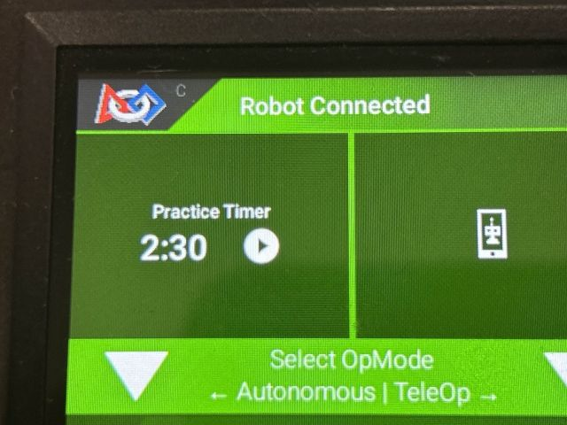
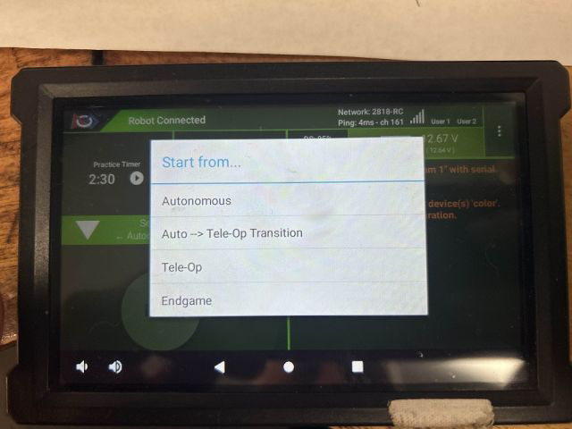

FTC Driver Station Practice Timer
=================================

Started in the 2023-2024 season, Tech Tips are segments released in the
*FIRST* Tech Challenge `Team E-mail Blast
<https://www.firstinspires.org/resource-library/ftc/team-blast-archive>`__.
Sometimes the Tech Tips are included in whole in the email blast, but sometimes
there is more content than is reasonable in the email blast so partial content
is included in the blast with the rest of the content here. 

.. _practicetimer:

**FTC Driver Station Practice Timer**

Did you know there's a powerful tool lurking within your FTC Driver Station App, 
designed to help your team dominate match timing? Forget the need for complex 
event software – your Driver Station has a built-in Practice Match timer that 
simulates the entire match flow, or any part of it! 
Imagine perfecting your autonomous routine, nailing the Auto-TeleOp transition, 
or optimizing your endgame strategy, all without the pressure of a real 
competition. This (not so) hidden gem allows teams to practice match timing for 
every critical phase: 

* Autonomous - Fine-tune your robot's pre-programmed actions. 
* Auto-TeleOp Transition - Seamlessly swap control from autonomous to TeleOp. 
* TeleOp - Maximize your scoring potential during the main TeleOp period. 
* Endgame - Strategize and execute your final, high-scoring moves. 

This feature is a game-changer for practice sessions, allowing your team to build 
muscle memory and confidence in a realistic, simulated environment. 
Ready to unlock your team's full potential?

*How does it work?* In the upper-left corner of the Driver Station App you will
see the "Practice Timer Window". This has the heading "Practice Timer" and has
the remaining time (in a possible practice match) as well as a "PLAY" button.
This Practice Timer area is always visible regardless of what OpModes are
running or any other activities (on the same screen). This Practice Timer also
runs independently of other activities, therefore OpModes can be selected,
started, stopped, selected, and so on while the Practice Timer is running
without affecting the timer.

   Practice Timer Window

.. tip::
   The Practice Timer uses audio for cues, be sure the audio is enabled and
   at sufficient volume to hear the cues for match transitions.

Press the tiny "Play" button in the Practice Timer window, and the software
will prompt where in the match to start the timer at. Options are:

* Autonomous
* Auto -> TeleOp Transition
* TeleOp
* Endgame (30s endgame, not updated for DECODE)

.. note::
   The *Autonomous* and *Transition* periods have audio cues that give the user
   time to select and start OpModes in sync with the match transition, whereas 
   the other options start as soon as the option is selected.

   Selecting the Practice Match starting Match Period

Got any questions about how to take advantage of the Practice Timer and other
features of the FTC Driver Station App? Come start or join the conversation 
on the `FTC Community Forums <https://ftc-community.firstinspires.org/>`__!

