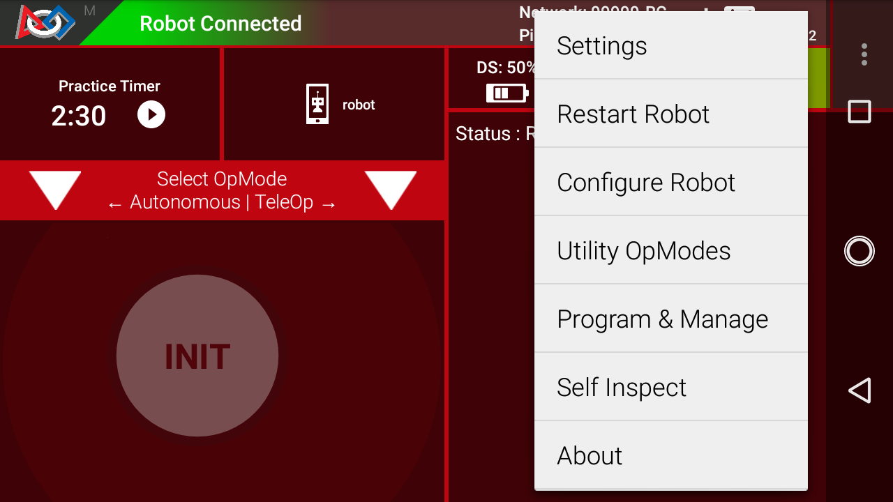
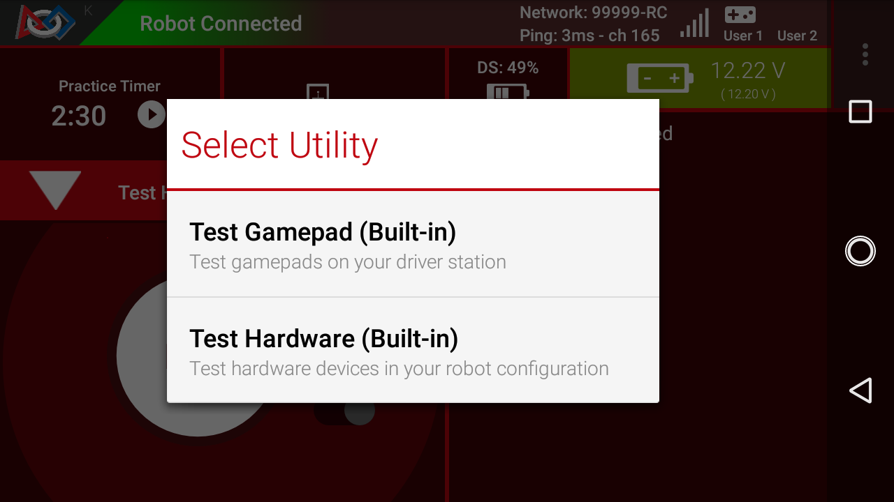

Utility OpModes
===============

Starting with version 11.2 of the *FIRST* Tech Challenge :term:`SDK <SDK>`,
Utility :term:`OpModes <OpMode>` are available to help test and troubleshoot your robot. Utility
OpModes can be run from the :term:`Driver Station App`.

.. toctree::
   :maxdepth: 1

   test_hardware/test_hardware_utility
   test_gamepad/test_gamepad_utility