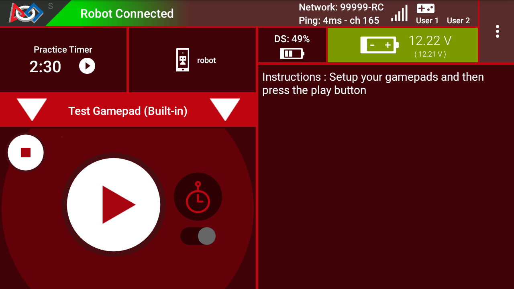
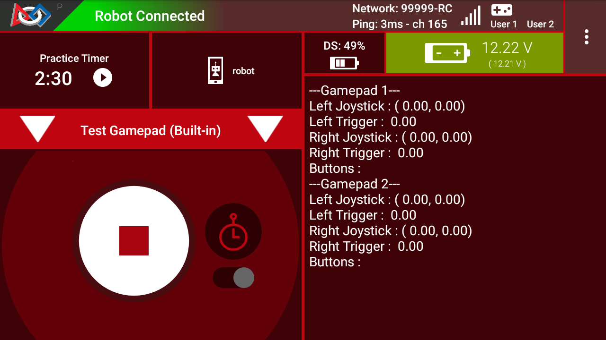

Test Gamepad Utility
====================

The Test Gamepad Utility :term:`OpMode` can be used to check how :term:`gamepad` inputs
register in the :term:`SDK`. To use it, first verify that your gamepads are
connected. Once you run the OpMode, it will show you what the currently
registered gamepad inputs are.

