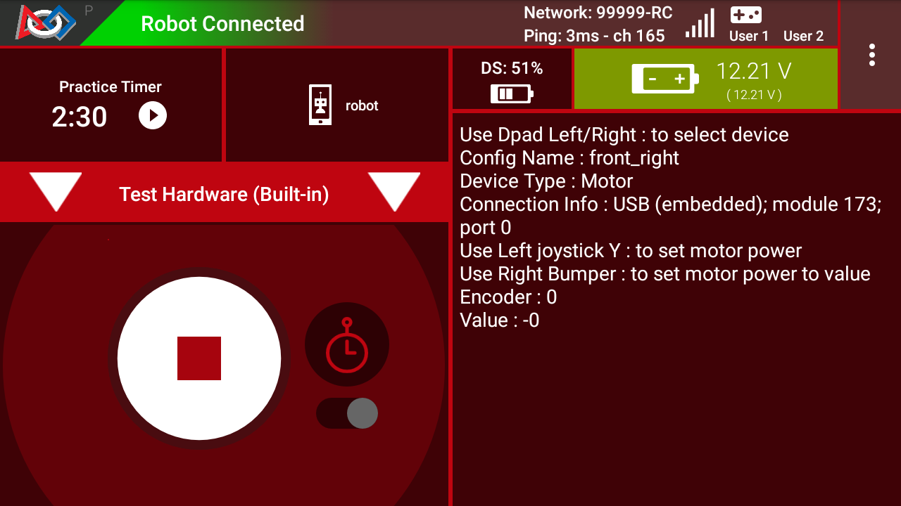

Test Hardware Utility
=====================

The Test Hardware Utility :term:`OpMode` can be used to verify that all
hardware in your :term:`configuration <Robot Configuration>` is working as
intended. To use it, follow the instructions in the :term:`telemetry` to cycle
through your hardware and set values. Remember to also look at the physical
robot and make sure your motors and servos are moving as expected.

